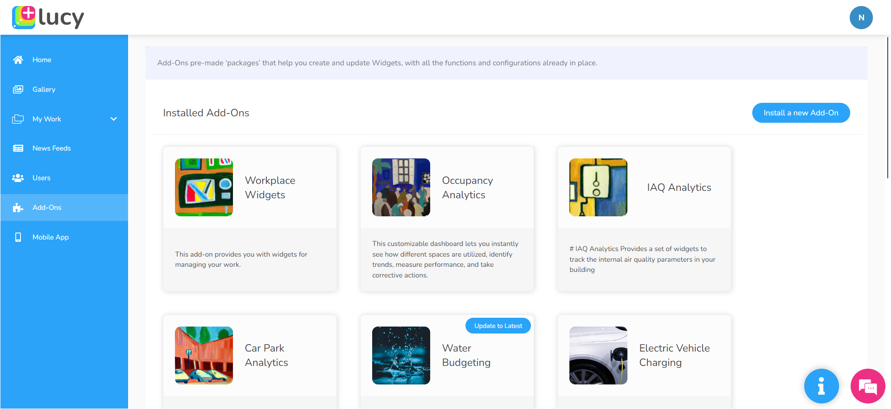

# Add-ons

Add-ons are pre-integrated bundles of workflows and dashboards and other interfaces that are ready to deploy and use out of the box.

Since add-ons are pre-made packages, no need to go through the hassle of building integrations yourself. These add-ons come with all the functions and configuration your widgets need, saving you time and effort.

The following image shows the Add-ons page with the add-ons currently installed in the system.

You can install new add-ons from this page to update your widgets.

<figure><figcaption>
Add-ons page
</figcaption></figure>
