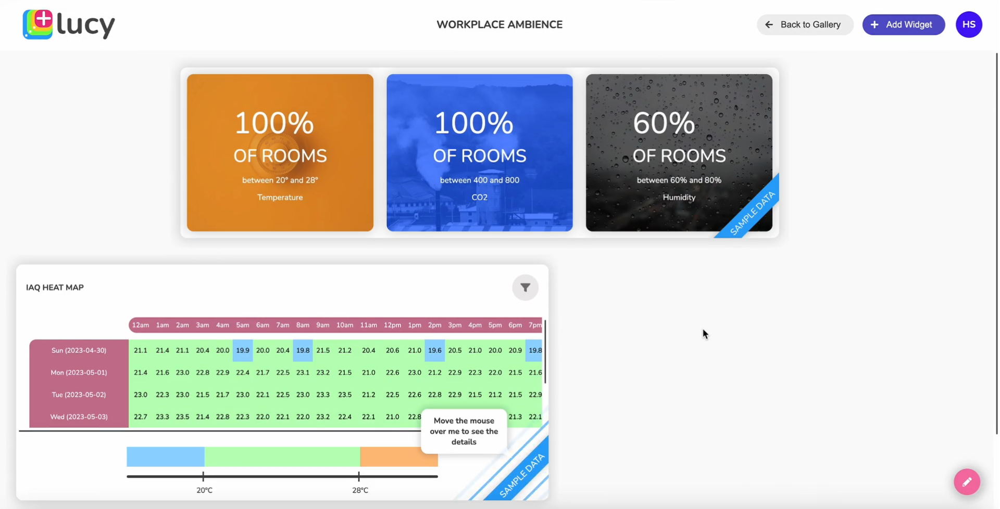

# Internal Air Quality (IAQ) Monitoring

**Internal Air Quality (IAQ)**

Internal Air Quality (IAQ) data refers to the information collected from monitoring various factors that affect the quality of indoor air. This data typically includes measurements of parameters such as temperature, humidity, carbon dioxide (CO2) levels, etc.

**Importance of Monitoring and Maintaining IAQ Data**

* **Health and Comfort:** Poor IAQ can lead to health issues such as respiratory problems, allergies, and headaches. By monitoring IAQ data, building occupants can be aware of the air they breath and take necessary precautions to mitigate potential health risks.
* **Productivity:** Good IAQ is linked to improved cognitive function and productivity. Monitoring IAQ data can help create a healthier and more comfortable indoor environment, leading to higher productivity levels among occupants.
* **Energy Efficiency:** Proper ventilation and control of indoor air pollutants can improve energy efficiency by reducing the need for excessive heating, cooling, and ventilation.
* **Regulatory Compliance**: Many jurisdictions have regulations and guidelines in place to ensure indoor air quality meets certain standards. Monitoring IAQ data helps ensure compliance with these regulations.
* **Building Maintenance:** IAQ data can also help identify issues with building systems, such as ventilation systems or building materials, that may need maintenance or replacement to improve indoor air quality.

## IAQ Analytics Add-on

IAQ Analytics add-on provides a set of widgets for monitoring internal air quality parameters in your workplace. This process involves three main steps:

1. [Installing the IAQ Analytics Add-on](internal-air-quality-iaq-monitoring.md#id-1.-installing-the-iaq-analytics-add-on)
2. [Configuring the IAQ Analytics Add-on](internal-air-quality-iaq-monitoring.md#id-2.-configuring-the-iaq-analytics-add-on)
3. [Creating Your Canvas/Dashboard](internal-air-quality-iaq-monitoring.md#id-3.-creating-your-canvas-dashboard)

### 1. Installing the IAQ Analytics Add-on

Installing the IAQ Analytics add-on is the first step to monitor indoor air quality in your workplace.

To install the IAQ Analytics Add-on:

1. On the Lucy app **homepage**, click the **Add-ons** tab. Add-ons page will be displayed.
2. Click **Install a new Add-on**.&#x20;
3. Pick the IAQ Analytics add-on from the list of add-ons.
4. Click **Install**. The add-on will be installed and will appear on the Add-ons page.


You can skip the installation if you have done it earlier.


### 2. Configuring the IAQ Analytics Add-on

This step involves setting up and connecting your IAQ devices to gather data. There are five sources from which IAQ data can be obtained.

* **API**: Setup API to send IAQ data
* **uHoo sensor:** If you have a Uhoo sensor, you can use uHoo API key to automatically configure it and start receiving sensor data.
* **Simulator:** Generates data for display on your IAQ related widgets, which is particularly useful when sensors are not available.
* **AWAIR Sensors:** If you have AWAIR sensors, you can use API key and Organization ID to automatically sync sensor data.
* **Buy from Spaceworx marketplace:** Buy third party products from Spaceworx Marketplace.

You can pick required source and configure it.

In the absence of real-time sensor data, we'll opt for simulated data. Let's select the simulator option and move forward.

1. On the app **homepage**, click the **Add-ons** tab. Add-ons page will open.
2. Click on the **IAQ Analytics** add-on. A configuration wizard will open to configure it.
3. Click **Let’s Start.**
4. Select the source to obtain IAQ data.
   1. Pick the **Simulator** option.
   2. Click **Next**. Now the data will be simulated, and you don't need to configure anything further.
   3. Click **Close**.

### 3. Creating Your Canvas/Dashboard

The last step is to build the canvas.

To create a canvas:

1. On the Lucy app **homepage,** click the **Gallery** tab.
2. Click the **+** button to start creating a new Canvas.
3. Click **Next**.
4. Customize the background of the canvas if needed.
   1. To select a color theme for your Canvas from the pre-selected color themes, click on the required box. Selected colour theme will be shown under the Header Colour section.
   2. If you need to select a custom color theme, click on the color code in the Header Colour section to open the color picker to select a color of your own.
   3. Under Background Image, click the Search icon to select a background wallpaper for your Canvas.
   4. To select an image from the available collection, first, type the required keyword in the Search Images box to search for the image and then select it.
   5. To select your own image as the background of the Canvas, click Upload your image and upload your own image.
   6. Enable the Blur the background option to blur the applied background of your Canvas if necessary.
5. Provide a suitable unique **Name** for the canvas.
6. Grant Access to the Canvas.
   1. Select a User Group (e.g., System Administrators) if you wish to grant access to specific groups.
   2. Skip the User Group selection if you intend to allow access for everyone.
7. Click **Next**. A new Canvas will be created and listed on the Gallery page.
8. &#x20;Click **Go to your Canvas now** button to launch it in a new window.
9. Pick and add IAQ related widgets on to your canvas.
   1. Click **+** button. Widget Browser will open.
   2. Use the Search box to search and filter required widgets by typing widget’s name/partial name, _e.g., IAQ._
   3. We'll select, for example, the IAQ Heat Map and IAQ Levels Display widgets.
   4. Click **Add Widgets.**
   5. Widgets will be added to the canvas. As soon as widgets are added, the canvas will display simulated data in those widgets.

### Displaying Real-time Data on IAQ related Widgets

Once you have the access to live sensor information, you can configure the sensor details by going back to the IAQ analytics add-on on the Add-ons page. After configuring the sensor details, the respective widgets will display live sensor data.

1. On the canvas, click **Back to Gallery.**
2. On the app homepage, click the **Add-ons** tab and open Add-ons page.
3. Click **IAQ Analytics** add-on.
4. Click **Let’s Start.**
5. Select your sensor to obtain IAQ data.
6. Click **Next**.
7. Configure the source.
8. After configuring the sensor details, the respective widgets will display live sensor data.
9. Launch your canvas.
   1. On the app homepage, click the **Gallery** tab.
   2. Pick the Canvas from the Gallery.&#x20;
   3. If there is a list of Canvases on the Gallery, you can search for the specific Canvas by typing its name/partial name under **Search Canvases.**
   4. Click on the required canvas to launch it. The widgets on the canvas will display live sensor data.

<figure><figcaption>
Canvas designed for monitoring and displaying Internal Air Quality (IAQ) data
</figcaption></figure>

The video below explains the process of monitoring Internal Air Quality (IAQ).


