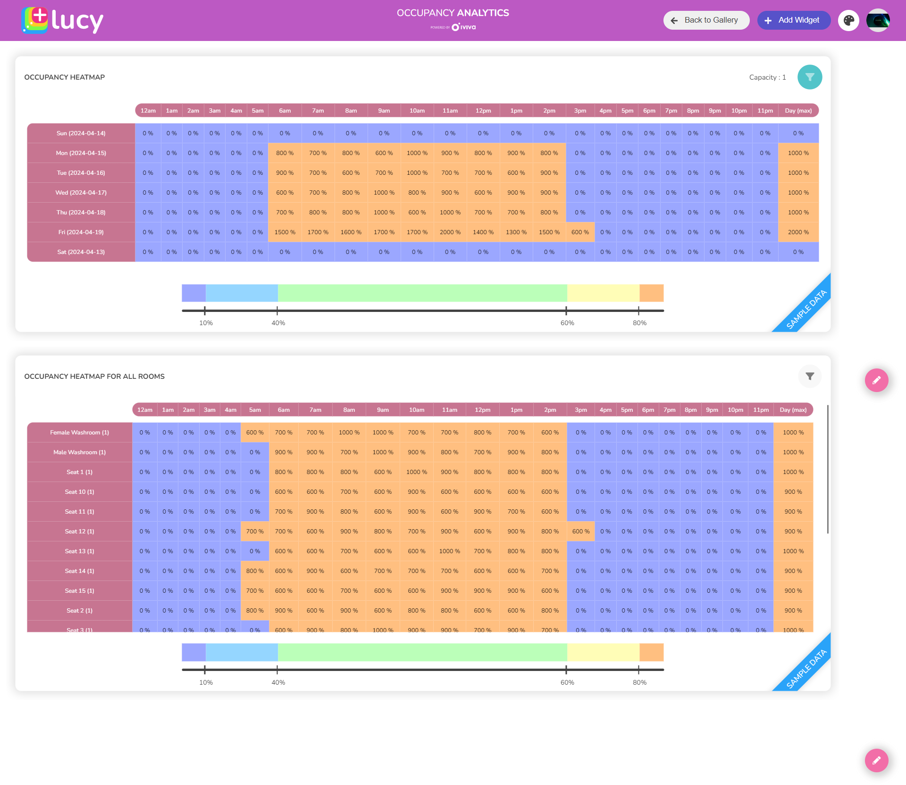

# Setting up Occupancy Analytics at Your Workplace

Occupancy analytics refers to the process of analysing and understanding how spaces within a building or facility are utilised. This analysis typically involves tracking metrics such as the number of people in a space and patterns of space usage over time. Occupancy analytics can provide valuable insights into how spaces are being used, helping organizations optimise their use of space, improve efficiency, and enhance the overall experience for occupants.

**Occupancy Analytics Add-on**

The Occupancy Analytics add-on lets you create custom canvases to track the utilisation of spaces and rooms. By using this add-on, you can monitor how different areas are being used and make informed decisions about space planning and resource allocation.

## Setting up Occupancy Analytics

This article explains the steps to set up occupancy analytics at your workplace.

Follow these steps to efficiently set up occupancy details.

1. [Creating Your Canvas](setting-up-occupancy-analytics-at-your-workplace.md#id-1.-creating-your-canvas)
2. [Installing the Occupancy Analytics Add-on](setting-up-occupancy-analytics-at-your-workplace.md#id-2.-installing-the-occupancy-analytics-add-on)
3. [Configuring the Occupancy Analytics Add-on](setting-up-occupancy-analytics-at-your-workplace.md#id-3.-configuring-the-occupancy-analytics-add-on)

### 1. Creating Your Canvas

To create a new canvas:

1. On the Lucy app **homepage,** click the **Gallery** tab.
2. Click the **+** button to start creating a new Canvas.
3. Click **Next**.
4. Customise the background of the canvas if needed.
   1. To select a colour theme for your Canvas from the pre-selected colour themes, click on the required box. Selected colour theme will be shown under the Header Colour section.
   2. If you need to select a custom colour theme, click on the colour code in the Header Colour section to open the colour picker to select a colour of your own.
   3. Under Background Image, click the Search icon to select a background wallpaper for your Canvas.
   4. To select an image from the available collection, first, type the required keyword in the Search Images box to search for the image and then select it.
   5. To select your own image as the background of the Canvas, click Upload your image and upload your own image.
   6. Enable the Blur the background option to blur the applied background of your Canvas if necessary.
5. Provide a suitable unique **Name** for the canvas, _e.g., Occupancy Analytics._
6. Grant Access to the Canvas.
   1. Select a User Group (e.g., System Administrators) if you wish to grant access to specific groups.
   2. &#x20;If you intend to allow access for everyone, skip the user group selection.
7. Click **Next**. A new Canvas will be created and listed on the Gallery page.
8. &#x20;Click **Go to your Canvas now** button to launch it in a new window.
9. Pick and add occupancy related widgets on to your canvas.
   1. Click **+** button. Widget Browser will open.
   2. Use the Search box to search and filter required widgets by typing widget’s name/partial name, _e.g., Occupancy._
   3. We’ll pick _e.g., Occupancy Heat map and Occupancy Heat map All Rooms_ widgets.
   4. Click **Add Widgets.**
   5. The widgets will be added to the canvas.

### 2. Installing the Occupancy Analytics Add-on

After adding required widgets, you can install the Occupancy Analytics add-on directly from the canvas.


Skip this step if you have already installed the Occupancy Analytics Add-on.


To install the add-on:

1. Click **Install** button of the respective widgets.
2. After installation, we can configure the add-on.

### 3. Configuring the Occupancy Analytics Add-on

After installing the Occupancy Analytics Add-on, we can configure the add-on directly from the canvas.

To configure the add-on:

1. Click **Let’s Start.**
2. Pick the source to get data. There three ways to get occupancy data to visualise on your canvas.
   1. **Pointgrab**: If you have PointGrab Occupancy sensors, you can enter PointGrab Client ID and PointGrab Client Secret and authenticate yourself.
   2. **Simulator**: Used to generate data so that you can display on your occupancy related widgets. This option is useful when sensors are not available.
   3. **Buy on Spaceworx**: Buy your products on Spaceworx marketplace.
3. Let’s select the **Simulator** option.
4. Click **Next**.
5. Click **Close**.
6. The respective widgets added to your canvas will display the occupancy data based on the simulated data.

<figure><figcaption>
Canvas designed for monitoring and displaying occupancy data
</figcaption></figure>

### Displaying Real-time Data on Widgets

Once you have the access to live sensor information, you can configure the sensor details by going back to the occupancy analytics add-on on the Add-ons page. After configuring the sensor details, the respective widgets will display live sensor data.

1. On the canvas, click **Back to Gallery.**
2. On the app homepage, click the **Add-ons** tab and open Add-ons page.
3. Click **Occupancy Analytics** add-on.
4. Click **Let’s Start.**
5. Pick **Pointgrab** sensor option.
6. Click **Next**.
7. Configure the sensor.
8. After configuring the sensor details, the respective widgets will display live sensor data.
9. Launch your canvas.
   1. On the app homepage, click the **Gallery** tab.
   2. Pick the Canvas from the Gallery.&#x20;
   3. If there is a list of Canvases on the Gallery, you can search for the specific Canvas by typing its name/partial name under **Search Canvases.**
   4. Click on the required canvas to launch it. The widgets on the canvas will display live sensor data.

The following video details how to monitor Occupancy data effectively.


