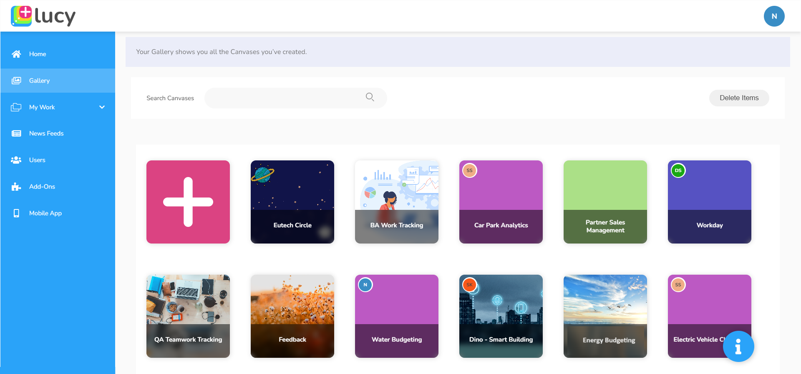

---
layout:
  title:
    visible: true
  description:
    visible: true
  tableOfContents:
    visible: true
  outline:
    visible: true
  pagination:
    visible: true
---

# Gallery

The **Gallery** in Lucy displays all the **Canvases** you and the other users have already created. It allows you to create your Canvases according to your requirements.\
\
To access the Gallery, to see all the Canvases on it,  go to the **Gallery** tab on the sidebar in Lucy and click on it.&#x20;

\
**What is a Canvas?**

A **Canvas** is a dashboard and it is your space where you can add Widgets to create, organise your work, and visualise data.&#x20;

You can customise the Gallery by adding your Canvases to it and editing them.

<figure><figcaption>
Gallery containing Canvases
</figcaption></figure>
