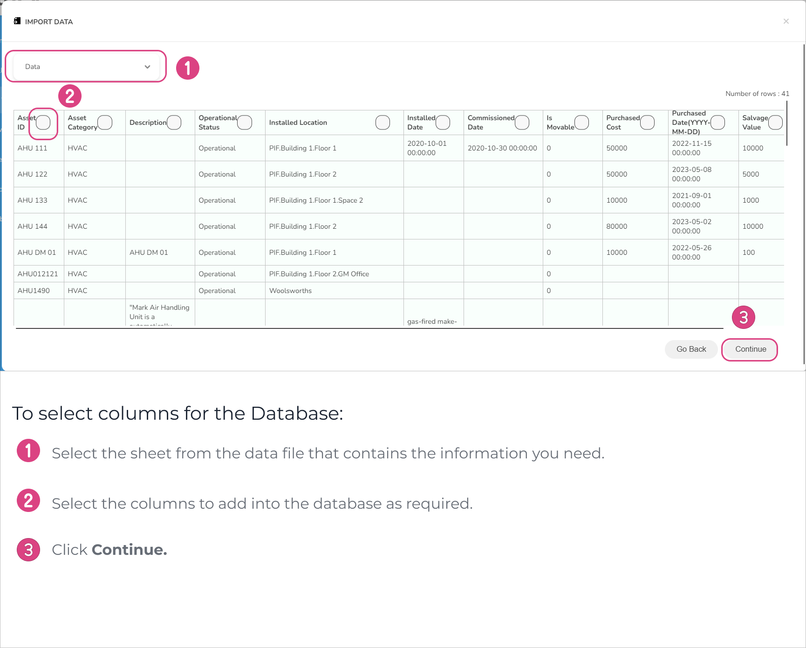

# Creating a Database by Importing Data from an External Source

Databases can be created by bringing data from sources outside the system. This approach is efficient, allowing you to quickly populate a new database with existing information. This is super handy, especially when you’re dealing with large datasets or when there is a need to set up a database rapidly.

Importing data also helps to maintain data integrity by reducing the risk of manual errors during the data entry process. This is particularly important for preventing data inconsistencies and ensuring accuracy. Additionally, users have the flexibility to select the required columns they need to create the database.


Currently, we support the import of data from **CSV** files and **xlsx** files.


Below is the step-by-step procedure for generating a new database by importing data from an external source.

1. On the app homepage, head to the **My Work** tab on the left sidebar.
2. Search and click on the **folder** you want to open.
3. Go to **Databases** tab.
4. Click **+** button.
5. Select **Import Data** option.
6. Drag and drop your data file onto the marked area, or click on the area to pick the file.
7. Once the file is uploaded, the data will be displayed in a spreadsheet format.
8. Select the sheet from the data file that contains the information you need.
9. Select only the columns you're interested in to include in the database.
10. Click **Continue**.
11. Provide a suitable name for the database.
12. Click **Create Database.** A new database will be created related to the respective folder.
13. Click **View Database** to open the database in a new window.

<figure><figcaption>
Selecting columns
</figcaption></figure>

<figure><figcaption>
Creating the database
</figcaption></figure>

Below is a preview of the newly created database.

<figure><figcaption>
Database preview
</figcaption></figure>

Watch the below video on creating a database by importing data from an external source to gain more insights.


