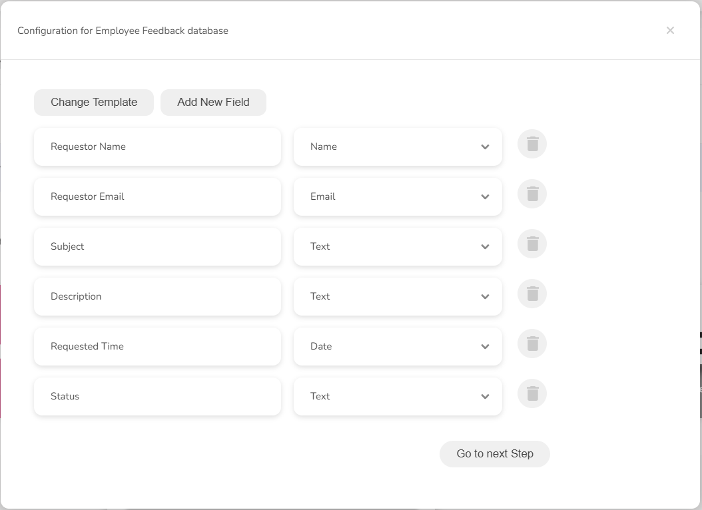

# Creating a Database Manually

Databases can be created either from the ground up or by choosing an existing template.&#x20;

When designing your database with an existing template, you can select a pre-designed template that comes with a predefined structure and build your database using it. This might require a few adjustments such as modifying available fields, adding more fields to tailor the database to your specific needs.

## <mark style="color:blue;">Creating a Database from Scratch</mark>

Besides selecting a template to create a database, you can always design your database yourself by adding required fields and their data types.

Let's create your database from scratch.

1. On the app homepage, go to the **My Work** tab on the left sidebar.
2. Search and click on the **folder** you want to open.
3. Go to **Databases** tab.
4. Click **+** button and pick **Create Manually** option.
5. Enter a meaningful **name** for your database.
6. Click **Continue**.
7. A list of existing templates will be displayed.
8. Click **Skip this step** or select the **Blank Template** from the template list.
9. Do required modifications (adding, editing, or modifying fields) to the database fields.
10. Add a new field/column.
    1. To add a new field, click on the Add New Field button.
    2. Type a suitable name for the Field added.
    3. After you have entered a meaningful name, its data type will be automatically picked.
    4. Select a different data type if necessary.
    5. Add more fields as required.
11. Edit a field.
    1. Pick the field you want to edit and modify the field name.
12. Delete a field.
    1. Pick the field you wish to delete from the list of fields.&#x20;
    2. Click the Delete icon respective to the field.
13. Click **Go to next Step**.
14. Once you have designed the structure of your database, click **Create New Database.**

<figure><figcaption>
Starting from scratch screen 1
</figcaption></figure>

<figure><figcaption>
Starting from scratch screen 2
</figcaption></figure>

The below screen will be displayed after creating a new database.

<figure><figcaption>
Your database has been created screen
</figcaption></figure>

## <mark style="color:blue;">Building a Database using an Existing Template</mark>

This section explains how you can select an existing template to build your database.&#x20;

Upon choosing a template, you will see its pre-designed collection of fields and types. You have the flexibility to fine-tune the structure as required by either adding, editing, or modifying fields as necessary.

Let's build our database using an existing template.&#x20;

1. On the app homepage, go to the **My Work** tab on the left sidebar.
2. Search and click on the **folder** you want to open.
3. Go to **Databases** tab.
4. Click **+** button and pick **Create Manually** option.
5. Enter a meaningful **name** for your database.
6. Click **Continue**.
7. A list of existing templates will be displayed.
8. Select a suitable **template** from the list.
9. Based on the selected template, its fields and types will be displayed.
10. Do required modifications (adding, editing, or modifying fields) to the database fields.
11. Add a new field/column.
    1. To add a new field, click on the Add New Field button.
    2. Type a suitable name for the Field added.
    3. After you have entered a meaningful name, its data type will be automatically picked.
    4. Select a different data type if necessary.
    5. Add more fields as required.
12. Edit a field.
    1. Pick the field you want to edit and modify the field name.
13. Delete a field.
    1. Pick the field you wish to delete from the list of fields.&#x20;
    2. Click the Delete icon respective to the field.
14. Change the Template selected.
    1. To change the template you have already selected, click **Change Template.**
    2. This action will redirect you to the template list screen for you to select a different one.
15. Click **Go to next Step**.
16. Once you have completed designing the database, click **Create New Database.**

<figure><figcaption>
Selecting a template
</figcaption></figure>

<figure><figcaption>
Selected template's fields and their types
</figcaption></figure>

Below is a short video that guides you on creating a database manually.



## <mark style="color:blue;">Previewing Your Database</mark>

Once you've established your database, you can preview its contents by navigating to the **Databases** tab within the corresponding folder.

1. On the app homepage, go to the **My Work** tab on the left sidebar.
2. Click on the **folder** you want to open.
3. Go to **Databases** tab.
4. Search and select your database.
5. Click on the database to view it.


&#x20;Initially, a manually created database is a empty database with no data.

