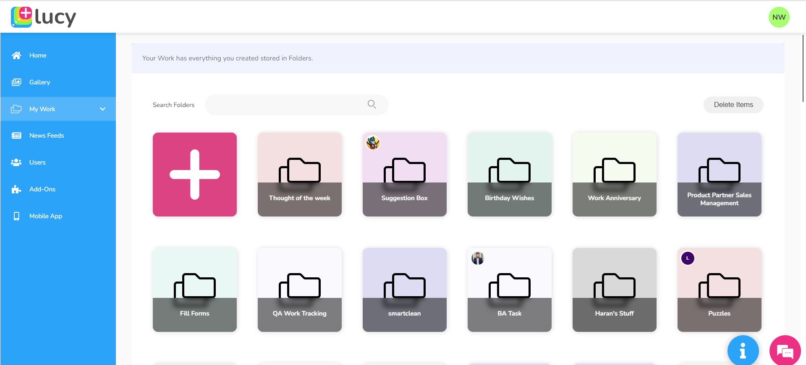

# Folders

Folders act as containers, encompassing all your creations, including notes, databases, workflows, and user interfaces. They play a crucial role in systematically organising and structuring your content, streamlining file management for users. You can create as many folders as you like to organise your work within Lucy.

You can locate and access your folders, as well as the folders created by others through the **My Work** tab.

<figure><figcaption>
My Work tab
</figcaption></figure>

Within every folder, you'll find five primary tabs outlined below:

1. **Notes**
2. **Databases**
3. **Workflows**
4. **User Interfaces**
5. **Ask me something**

<table><thead><tr><th width="265">Tabs within a folder</th><th>Description</th></tr></thead><tbody><tr><td><strong>Notes</strong></td><td>Used to save textual details about the contents within the folder</td></tr><tr><td><strong>Databases</strong></td><td>
Lists the databases created related to a folder. Databases are document-based schema-less storage containers for any kind of data you want. 

You can create, edit and delete databases under this tab.
</td></tr><tr><td><strong>Workflows</strong></td><td>
Lists workflows created within a specific folder. Workflows enable the creation of automated sequences of actions that interact with various applications, allowing for efficient and streamlined processes. A workflow is initiated by a trigger event, followed by the execution of predetermined actions in response to that event. 

You can create, edit and delete workflows under this tab. 
</td></tr><tr><td><strong>User Interfaces</strong></td><td>
Lists user interfaces created related to a specific folder. User Interfaces can be used to represent something on display. 

You can create, edit and delete user interfaces under this tab.
</td></tr><tr><td><strong>Ask me something</strong></td><td>Used to build a widget based on a question entered related to the databases inside a specific folder.</td></tr></tbody></table>

Watch below video on working with folders to gain a better understanding.


