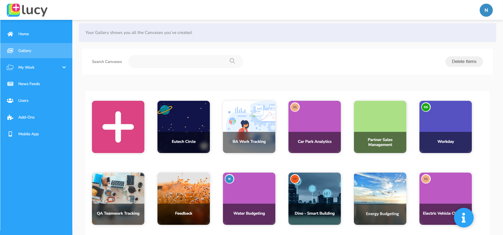

# Gallery (Dashboards)

The **Gallery** tab in Lucy displays all the **Canvases** you and the other users have already created. It also provides the option to create new canvases according to your requirements.\
\
To access the Gallery, to see all the canvases on it,  go to the **Gallery** tab on the sidebar in Lucy and click on it.&#x20;

<figure><figcaption>
Gallery containing Canvases
</figcaption></figure>

## **What is a Canvas/Dashboard?**

A dashboard or canvas provides a space where you can add widgets to visualise data. It plays a crucial role in simplifying complex data and enhancing decision-making processes, allowing users to monitor real-time data and track what's happening in their business or system.&#x20;

Dashboards simplify data presentation by using charts, graphs, maps, and other visual elements to convey information in a format that is easily digestible and understandable.

Lucy allows you to create unlimited personalised canvases tailored to your unique preferences. Here is an example of a canvas created in Lucy.

<figure><figcaption>
Example of a Canvas/Dashboard
</figcaption></figure>

