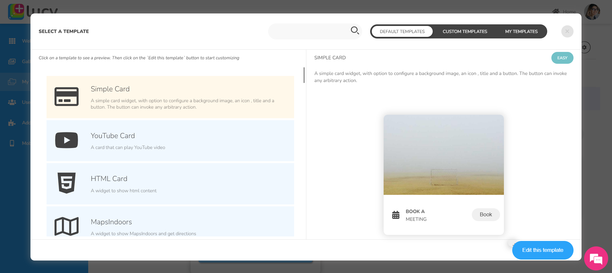

# Adding and Configuring Tabs in the Bottom Tab Bar Navigation

After setting up the Lucy mobile app, you can begin creating pages and navigation. By default, the Bottom Tab Bar Navigation includes the Home and Settings tabs. You can customise these and add more tabs as needed.

When you switch between tabs, you can configure the type of screen that opens for each tab.

## Adding and Configuring Tabs in the Bottom Tab Bar Navigation

To add a new tab to your bottom tab bar navigation of the mobile app.

1. On the Lucy web app homepage, go to the **Mobile App** tab. Mobile screen displays.
2. Adding a New Tab
   1. On the mobile screen, click the bottom section to open the properties panel on the right.
   2. In the **Configure Tabs** section of the properties panel, click the **Add Tab** button.
   3. A new tab will be added along with an icon in the bottom tab bar navigation.
   4. Enter a appropriate **Name** for the new tab (e.g., Feeds).
   5. To change the tab icon, click the icon and select an appropriate one from the Search Icons window.
   6. Choose the screen type to display when the tab is clicked: Sections, Widgets, or Custom Mobile Pages.
   7. Click **Save** to apply the changes in the mobile app.
   8. Open the mobile app to view changes.

<figure><figcaption>
Adding a new tab screen 1
</figcaption></figure>

<figure><figcaption>
Adding a new tab screen 2
</figcaption></figure>

## Screen Types

When a tab is clicked in your mobile app, you can display one of three screen types:

1. **Sections**
2. **Widgets**
3. **Custom Mobile Pages**

### 1) Sections

Effortlessly add, configure, and display various horizontal sections on a mobile screen. Simply drag and drop them into place. Each section serves a unique purpose and enhances the user experience.

You can add the same section multiple times if necessary.

#### Types of Sections

a) Custom UI Section

Use the Custom UI Section to create a personalized user interface with JSON code.

To add a Custom UI Section:

1. On the Lucy web app homepage, go to the **Mobile App** tab. Mobile screen displays.
2. Click the Bottom Tab Bar Navigation.
3. In the Bottom Tab Bar Navigation, click the required tab.
4. Under **Configure Tabs** section,  select the **Type** as **Sections.**
5. Go to the **Sections** tab on the left.
6. Drag and drop the '**Describe a custom interface with a special interface language'** section on to the desired area on the mobile screen.
7. A horizontal section named Custom UI will appear on the mobile screen.
8. Click the Custom UI section to open its properties panel.
9.

<figure><figcaption>
Adding a Custom UI section screen 1
</figcaption></figure>

<figure><figcaption>
Adding a Custom UI section screen 2
</figcaption></figure>

b) Icon Section Widget

You can include a set of icons in an Icon Section Widget.

To add a Icon Section Widget:

1. On the Lucy web app homepage, go to the **Mobile App** tab. Mobile screen displays.
2. Click the Bottom Tab Bar Navigation.
3. In the Bottom Tab Bar Navigation, click the required tab.
4. Under **Configure Tabs** section,  select the **Type** as **Sections.**
5. Go to the **Sections** tab on the left.
6. Pick the **Icon Section Widget.** Drag and drop it onto the mobile screen.
7. Click **Save** to apply the changes in the mobile app.

<figure><figcaption>
Icon Section Widget
</figcaption></figure>

c) Image Card List

To add a Image Card List:

1. On the Lucy web app homepage, go to the **Mobile App** tab. Mobile screen displays.
2. Click the Bottom Tab Bar Navigation.
3. In the Bottom Tab Bar Navigation, click the required tab.
4. Under **Configure Tabs** section,  select the **Type** as **Sections.**
5. Go to the **Sections** tab on the left.
6. Pick the **Image Card List.** Drag and drop it onto the mobile screen.
7. Click **Save** to apply the changes in the mobile app.

<figure><figcaption>
Image Card List
</figcaption></figure>

d) Horizontal List of Cards

To add a Horizontal List of Cards:

1. On the Lucy web app homepage, go to the **Mobile App** tab. Mobile screen displays.
2. Click the Bottom Tab Bar Navigation.
3. In the Bottom Tab Bar Navigation, click the required tab.
4. Under **Configure Tabs** section,  select the **Type** as **Sections.**
5. Go to the **Sections** tab on the left.
6. Pick the **Horizontal List of Cards.** Drag and drop it onto the mobile screen.
7. Click **Save** to apply the changes in the mobile app.

<figure><figcaption>
Horizontal List of Cards
</figcaption></figure>

e) Currency Converter Widget

To add a Currency Converter Widget:

1. On the Lucy web app homepage, go to the **Mobile App** tab. Mobile screen displays.
2. Click the Bottom Tab Bar Navigation.
3. In the Bottom Tab Bar Navigation, click the required tab.
4. Under **Configure Tabs** section,  select the **Type** as **Sections.**
5. Go to the **Sections** tab on the left.
6. Pick the **Currency Converter Widget.** Drag and drop it onto the mobile screen.
7. Click **Save** to apply the changes in the mobile app.

<figure><figcaption>
Currency Converter Widget
</figcaption></figure>

f) Configurable Search Widget

To add a Configurable Search Widget:

1. On the Lucy web app homepage, go to the **Mobile App** tab. Mobile screen displays.
2. Click the Bottom Tab Bar Navigation.
3. In the Bottom Tab Bar Navigation, click the required tab.
4. Under **Configure Tabs** section,  select the **Type** as **Sections.**
5. Go to the **Sections** tab on the left.
6. Pick the **Configurable Search Widget.** Drag and drop it onto the mobile screen.
7. Click **Save** to apply the changes in the mobile app.

<figure><figcaption>
Configurable Search Widget
</figcaption></figure>

### 2) Widgets

You can link a preconfigured widget to a specific tab to display it when clicked.&#x20;

To link a widget to a specific tab:

1. On the Lucy web app homepage, go to the **Mobile App** tab. Mobile screen displays.
2. Click the Bottom Tab Bar Navigation.
3. In the Bottom Tab Bar Navigation, click the required tab.
4. Under **Configure Tabs** section,  select the **Type** as **Widget.**
5. Click the **Select a Widget** button.
6. Pick the required widget from the list (widget names will appear in the list).&#x20;
7. Click **Save** to apply the changes. The selected widget will now display in your app under the required tab.

The screen below displays a widget created using the Search widget template, linked to the Assets tab.

<figure><figcaption>
Widget example
</figcaption></figure>

### 3) Custom Mobile Pages

Custom Mobile Pages are unique to the mobile app and are not available in the Lucy web app. Though the mobile app is configured using the Lucy web platform, these pages are specifically designed for mobile use.

For instance, the Settings page in the mobile app is a custom mobile page. It displays personal details, currency, language etc., which are not that relevant to the Lucy web app.

<figure><figcaption>
Settings screen
</figcaption></figure>
