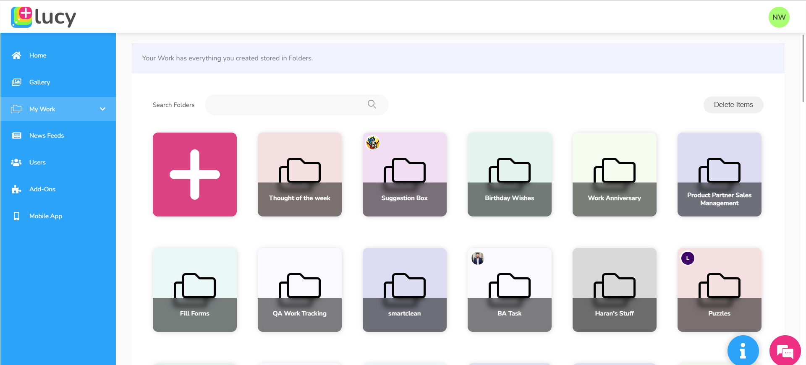

# Projects

Projects or folders act as containers, encompassing all your creations, including notes, databases, workflows, and user interfaces. They play a crucial role in systematically organizing and structuring your content, streamlining file management for users. You can create as many folders as you like to organize your work within Lucy.

You can locate and access your projects, as well as the projects created by others through the **My Work** tab.

<figure><figcaption>
My Work tab
</figcaption></figure>
