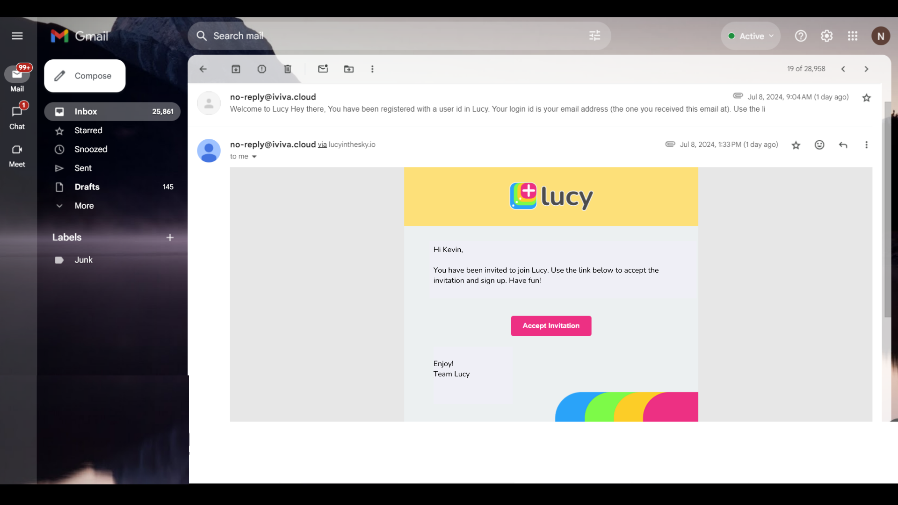

# Registering a User

Typically, administrators create new users. There are two ways to register a user in Lucy.

1. [Registering Users Directly in the System](registering-a-user.md#id-1.-registering-users-directly-in-the-system)
2. [Inviting Users via Sending a Welcome Email](registering-a-user.md#id-2.-inviting-users-via-sending-a-welcome-email)

As a prerequisite, you need to create User Groups before registering a user.


[creating-a-user-group.md](creating-a-user-group.md)


## <mark style="color:blue;">1. Registering Users Directly in the System</mark>

This method is used to directly create new users in the system. As a system administrator, to register a new user in Lucy:

1. On the Lucy app homepage, click on the **Users** menu item on the left.
2. Click the **+** button.
3. Enter the **user name**.
4. Type in user’s **email address.**
5. Pick the appropriate **User Group** _e.g., Property Manager._
6. Select the **Set the user’s password** option. If the **Set the user’s password** option is enabled, it will display the **Initial Password** box for entering the user's password and activating the feature to directly create a new user in the system.
7. Enter a **password** for the user.
8. Enable the **Send a welcome email** option if necessary to send a welcome email to the user’s email address after registering the user.
9. Click **Register User.** The newly created user will be listed on the Users page.


If the **Set the user’s password** option is enabled, it will display the **Initial Password** box for entering the user's password and activating the feature to directly create a new user in the system.

If the **Set the user’s password** option is not enabled, the **Initial Password** box will be hidden, activating the feature to send an invitation to your email address, allowing you to create your own account.



The **User Group** field is exclusively visible to administrators, and only they possess the authority to modify the User Group assignment for a user.


## <mark style="color:blue;">2. Inviting Users via Sending a Welcome Email</mark>

As a system administrator, you have the option to facilitate the account creation process for new users by sending them an invitation email.

1. On the Lucy app homepage, click on the **Users** menu item on the left.
2. Click on the **+** button.
3. Enter the **user name**.
4. Type in the user’s **email address**.
5. Select the **user group** of the user _e.g., Regular User._
6. Untick the **Set the user’s password** option.&#x20;
7. Click **Invite User.** An invitation request will be sent to the respective user's email address, allowing them to create their own account.
8. Click the **Accept Invitation** link in the email to setup your account.

This is an example of an invitation email you'll receive.

<figure><figcaption>
Sample Invitation Email
</figcaption></figure>

Here is a video on registering users to gain better understanding.


