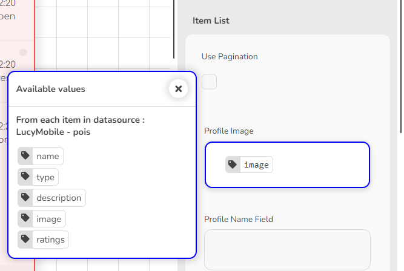

# Automating Form Submission with Email Notification

You can create a workflow to automate sending an email to users when they submit a form.&#x20;

Once the form is submitted, the automation would be triggered to send an email notification to the user who submitted the form. You can also configure the automation to send the email to a different recipient if desired.

By setting up such workflows, you can eliminate manual data entry and ensure timely delivery of important information.


Familiarity with creating [folders ](../folders/creating-a-new-folder.md)and [databases ](../databases/creating-and-editing-databases/)is recommended to accelerate your learning process.



Folders serve as containers designed to store and organize your work, such as notes, databases, user interfaces, and workflows.


Here are basics to create a workflow to automate sending an email to relevant users when they submit a form in Lucy.&#x20;

1. [Creating a Form](automating-form-submission-with-email-notification.md#id-1-creating-a-form)
2. [Configuring the Automation](automating-form-submission-with-email-notification.md#id-2-configuring-the-automation)
3. [Testing the Automation](automating-form-submission-with-email-notification.md#id-3-testing-the-automation)

### 1) Creating a Form

To get started, we'll need a form to collect user feedback. If you haven't already created one, refer to this article for guidance on designing and building a form that effectively captures the information you need.


[designing-a-user-interface-to-capture-user-feedback.md](../user-interfaces/designing-a-user-interface/designing-a-user-interface-to-capture-user-feedback.md)


<figure><figcaption>
Creating a form
</figcaption></figure>

When designing a form, you can always start from scratch, yet it is generally advisable to start creating a form from a database.

### 2) Creating the Automation

After creating the form, follow these steps to create a system to automate sending an email to relevant users when they submit a form in Lucy.&#x20;

1. On the Lucy app **homepage**, go to the **My Work** tab.
2. A list of folders appear. Locate and select the folder containing your form user interface.
3. Go to the **User Interfaces** tab.
4. Locate your form. Mouse hover over it and click the **Edit** icon that appears.
5. Your form will open on the widget designer page.
6. Click the **Share** button on the top right and go to the Automations section.
7. Click the **When someone submits data, send an emai**l option.
8. Send the email to the address entered in the form or add the Recipient's email address.
   1. If the recipient's email is captured in the form and if you wish to use that email as the recipient's email, select the **Send the email to the address captured in the Email** option**.**
   2. If you prefer to manually enter the recipient's email address, deselect the **Send the email to the address captured in the Email** option and type the email address in the box displayed.
9. **Subject**: Type in the desired subject line for the email.
10. Include the submitted data in the body of the email or type in a custom message.
    1. **Include the submitted data in the email body** option**:** If you want to include the submitted form data in the email body, select the 'Include the submitted data in the email body' option.
    2. If you prefer a custom message, deselect the **Include the submitted data in the email body** option and type your message in the **Custom Message** box.
11. Click **Create Automation.**

<figure><figcaption>
Creating the automation
</figcaption></figure>

### 3) Testing the Automation

Now, let's test the automation by submitting the form.

1. On the widget designer page, click **Share**.
2. Click **Open page** and your form will open in a new window.
3. Fill out the form details and click **Submit**.
4. A short time later, an email will be sent to the intended recipient. Check the recipient's email inbox for the

<figure><figcaption>
Sample Email sent to recipient
</figcaption></figure>
