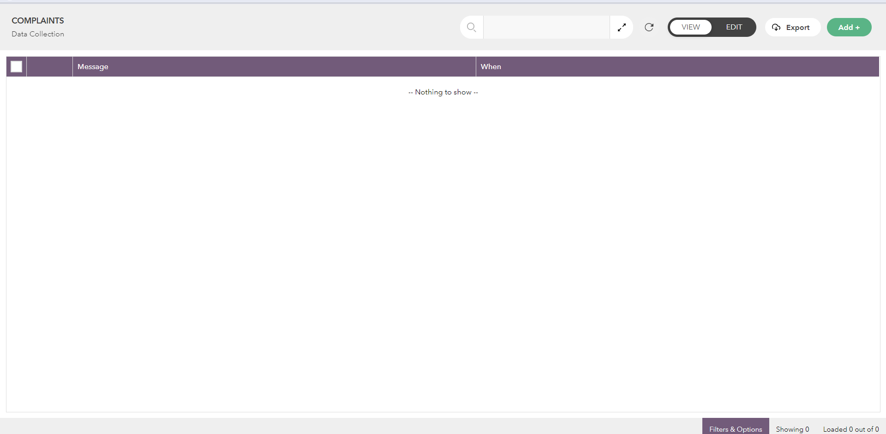

# Creating a Workflow to Run When a Message from a Chatbot is Received

You can create workflow automations linked to popular messaging apps. This way, users can interact with Lucy through their favorite chat app, while the system automatically handles tasks whenever a message is posted in a chat.

Lucy now supports creating bots for Telegram, the widely-used messaging platform. Easily register a new bot and integrate it with a Lucy workflow for seamless bot operations.

Let's build a simple bot that will receive requests from clients, store them in a database, and send you an email for each new request.

Here are the steps:

1. Creating a Database
2. Creating a Workflow
3. Testing the Workflow

## Creating a Database

We'll create a database manually.

1. On the app **homepage**, go to the **My Work** tab on the left sidebar.
2. Click on the required folder to open it.
3. If you cannot locate the folder in the list, type in the folder name under **Search Folders.** From the search results, click on the desired folder to open it.
4. Go to the **Databases** tab.
5. Click the **Plus** icon and pick **Create Manually** option.
6. Enter a **name** for your database, _e.g., Complaints._
7. Click **Continue**.
8. Click **Skip this step.**
9. Add required fields.
   1. Click **Add New Field** button.
   2. Type in the **Field names.**
   3. The type of the field will be automatically picked by the system.
   4. Click **Go to next Step.**
10. Click **Create New Database**. The database will be created within the folder.

<figure><figcaption>
Adding Fields to the database
</figcaption></figure>

<figure><figcaption>
Newly created database
</figcaption></figure>

## Creating a Workflow

Upon creating the database, we'll create a simple workflow that triggers whenever someone sends a message via a telegram bot.

1. On the app **homepage**, go to the **My Work** tab on the left sidebar.
2. Open the same folder where you created the database.
3. Go to the **Workflows** tab.
4. Click the **Plus** icon and the Workflow Editor page opens.
5. Select **How do you want to trigger your workflow?** box.
6. Select **When a telegram message from bot has been received** trigger.
7. Choose a Telegram bot.
   1. If you have existing bots created, pick the bot from the selection box or you can create a new one.
8. Register a bot. To register a bot, you need to start conversation with the BotFather account.
   1. To create new bot, click **Create a Telegram bot** option.
   2. This opens a instruction window with a video to guide you.
   3. Download the **Telegram** desktop app and sign in to your account.
   4. Add BotFather user.
   5. To start a conversation with the BotFather account, enter the '**/newbot'** command.
   6. Enter a **name** for your bot.
   7. Then provide a **Username** for the bot.
   8. Your bot will be created and you will get a token from the bot as a reply message.
9. Enter your bot details.
   1. On the workflow editor window, open the instructions window.
   2. Under the **Step 4: Enter your bot details** section, enter your Bot Registration Token.
   3. Type in the **Bot Name.**
   4. In the **Bot Handle** text box, provide the username.
   5. Click **Save**.
10. Populate data into the database.
    1. On the workflow editor, click the **plus** icon to add another block.
    2. Select the **Databases and Analytics** category block and pick the **Insert into Database** block.&#x20;
    3. Click the arrow icon and pick the database we previously created.
    4. Pick required tokens for the database attributes.
11. On the workflow editor, click the **plus** icon to add another block.
12. Pick the **Send Email** block.
13. Click the arrow icon and fill in the email details (Enter the Subject, To and Body fields).
14. Provide a  meaningful **Name** for the workflow and save it. Now our workflow is created.


All your saved workflows will be listed under the **Workflows** tab within the respective folder.


<figure><figcaption>
Selecting a Telegram Bot or creating a new bot 
</figcaption></figure>

<figure><figcaption>
Entering your bot details
</figcaption></figure>

<figure><figcaption>
Designing the workflow screen 1
</figcaption></figure>

<figure><figcaption>
Designing the workflow screen 2
</figcaption></figure>

## Testing the Workflow

Now let's see how our workflow works.

1. Open the bot in the Telegram app.
2. Send a complaint message.
3. Let's check our database.
   1. Go to the **Databases** tab within your folder.
   2. Click the respective database to open it. You will see the message from the bot has been added to the database.
4. Whenever someone sends a message via the Telegram app, it will be added to the database and we will receive an email.

Watch below video on setting up a workflow automation
