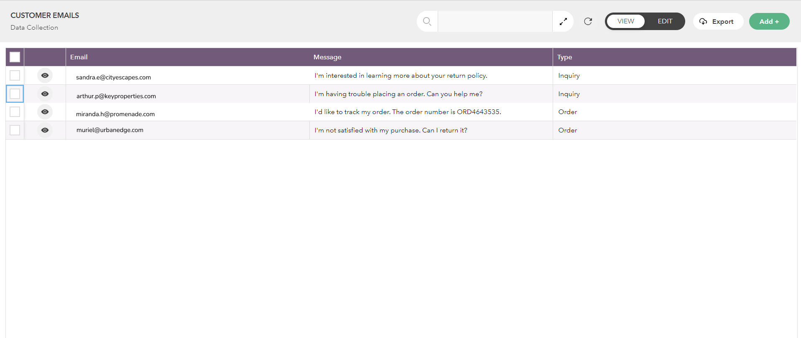

# Creating a Workflow to Run When an Email is Received

Automating tasks can greatly improve workflow efficiency. One effective approach is setting up a workflow that initiates when an email is received.

Learn how to create a workflow to handle incoming emails and save them in a database. To handle incoming emails, we need to forward them to a designated address and then send the data to a database.

For example, we can create a simple workflow to categorise each email we receive from clients as either an 'Order' or an 'Inquiry' and store them in a database.

Here are the basic steps to achieve that.

1. Setting Up Email Forwarding
2. Creating a Database with Content-Aware Autofill Feature
3. Creating the Workflow
4. Testing the Workflow

## 1) Setting Up Email Forwarding

Generally, we cannot directly listen to incoming emails. However, we can configure forwarding of incoming emails to another address.&#x20;


The forwarding email address should follow this format: your name.organization name@inbox.lucyhq.com. For example, _collins.eutech@inbox.lucyhq.com._

Ensure it ends with '**.organization name@inbox.lucyhq.com'.**


Steps to Set up Email Forwarding

1. Log in to your Gmail account that you want to forward emails from.
2. In the top right, click **Settings** and click **See all settings.**
3. Click the **Forwarding and POP/IMAP** tab.
4. In the "Forwarding" section, click **Add a forwarding address**.
5. Enter the email address you want to forward emails to _e.g., collins.eutech@inbox.lucyhq.com._
6. Click **Next**. Complete the Google verification process.&#x20;
7. Click **Proceed** and Click **OK**.
8. A confirmation link will be sent to the email address that you want to forward emails from. Click the link in that message.
9. Click **Confirm. **<mark style="color:blue;">**Note:**</mark> <mark style="color:blue;">Confirmation is necessary to ensure that incoming emails are redirected to the original email address.</mark>
10. Go back to the settings page for the Gmail account you want to forward messages from, and refresh your browser.
11. Click the **Forwarding and POP/IMAP** tab.
12. In the "Forwarding" section, select **Forward a copy of incoming mail to** and it will automatically pick your forwarding email address.
13. Choose what you want to happen with the Gmail copy of your emails. We recommend **Keep Gmail's copy in the Inbox.**
14. Click **Save Changes.**

## 2) Creating a Database with Content-Aware Autofill Feature

Let's create a simple database.

1. On the app **homepage**, go to the **My Work** tab on the left sidebar.
2. All the folders you have created, as well as those created by others, will be listed.
3. Click on the required folder to open it.
4. Go to the **Databases** tab.
5. Click the **Plus icon** and pick the **Create Manually** option.
6. Enter a meaningful **name** for your database.
7. Click **Continue**.
8. Click **Skip this Step.**
9. Add Fields to the database.
10. Click **Go to Next Step**. Once you have designed the structure of your database, click **Create New Database.** An empty database will be created.

### Utilising Content-Aware Autofill to Automatically Populate Your Database

After creating the database, insert data into it and activate the content-aware autofill feature.

<figure><figcaption>
Sample database
</figcaption></figure>

<figure><figcaption>
Activating the content-aware autofill feature
</figcaption></figure>

Refer to this article on how to use content-aware autofill to auto populate your database.


[utilising-content-aware-autofill-to-automatically-fill-in-fields-in-your-database.md](../databases/utilising-content-aware-autofill-to-automatically-fill-in-fields-in-your-database.md)


This is an example of the database we created.

## 3) Creating the Workflow

Next, let's create the workflow.

1. On the Lucy app **homepage**, click the **My Work** tab on the left.&#x20;
2. All the folders you have created, as well as those created by others, will be listed.&#x20;
3. Click on the desired folder.
4. Inside the folder, click the **Workflows** tab.
5. Click the **+** icon. Workflow editor page will open.
6. Select the email trigger and configure it.
   1. Click the **How do you want to trigger your workflow?** box.
   2. Pick **When someone send a email** trigger from the list.
   3. Enter the email address that you want to forward emails to, e.g., _collins.eutech@inbox.lucyhq.com._
   4. Click **Use this email address.** The trigger block will be added and displayed on the workflow editor page.
7. Add the block that defines the action to execute when the workflow is triggered.
   1. Click the **+** icon of the trigger block.
   2. Click on the **Databases and Analytics** category and pick **Insert into Database** block. The selected block will be added and displayed.
   3. Click the **arrow** icon .png>)to open **Insert into Database** block's properties section.
      1. Select the Database you wish to insert data you receive.
      2. Once the database is selected, its fields will be displayed.
      3. Add Pills to the required fields. Pills originate from previous blocks added in the workflow, and you can use them in input fields.
         1. Click on a field and a list of pills will appear in a pop-up window. Select required pills from the pop-up to be added in the field.
         2. Customise each field as necessary.
8. Provide a suitable **name** for the workflow in the text box on the top left.
9. Click **Save**.


All your saved workflows will be listed under the **Workflows** tab within the respective folder.


<figure><figcaption>
Configuring the Email trigger block
</figcaption></figure>

<figure><figcaption>
Workflow diagram
</figcaption></figure>

## 3) Testing the Workflow

Each incoming email will be automatically forwarded to the designated address, recorded in the corresponding database, and categorised accordingly.

<figure><figcaption>
Testing the workflow
</figcaption></figure>

Watch this video on how to automate handling incoming emails and saving them in a database.


